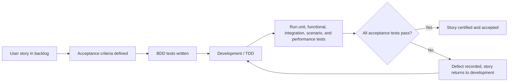
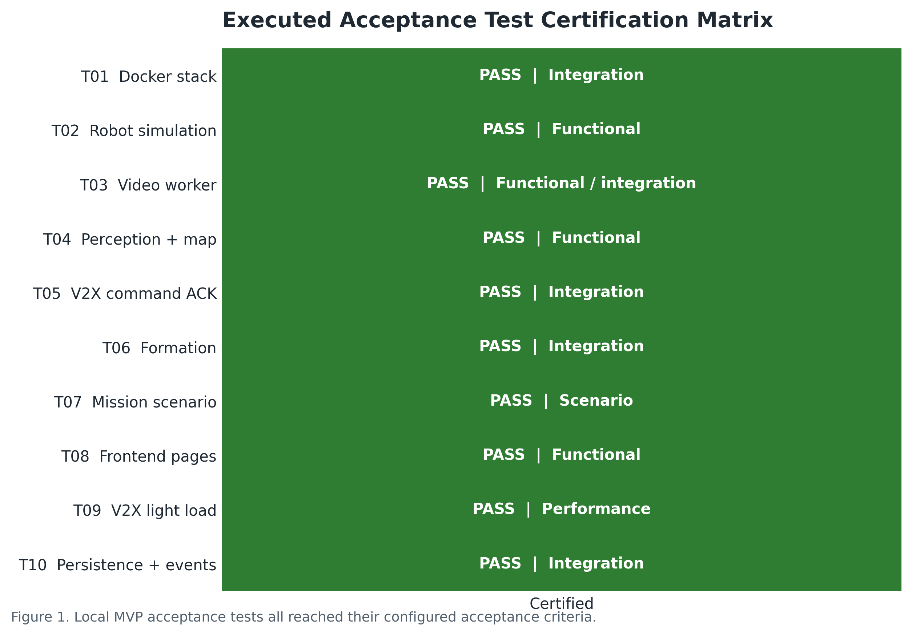
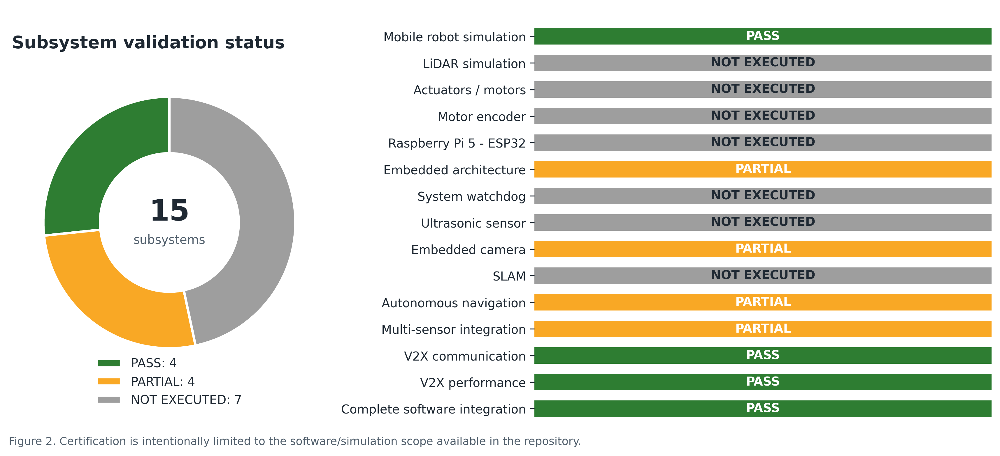
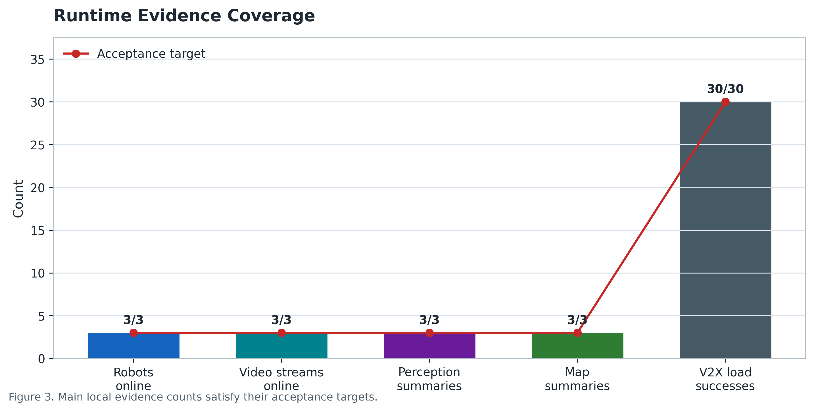
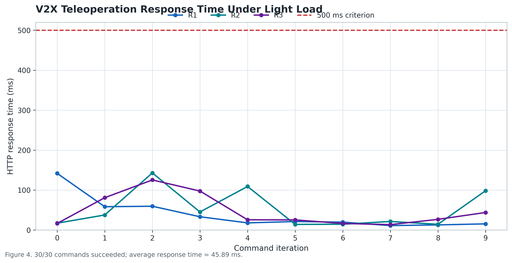
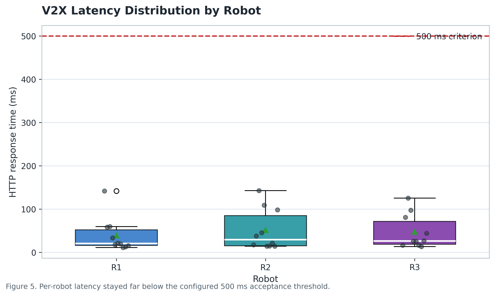
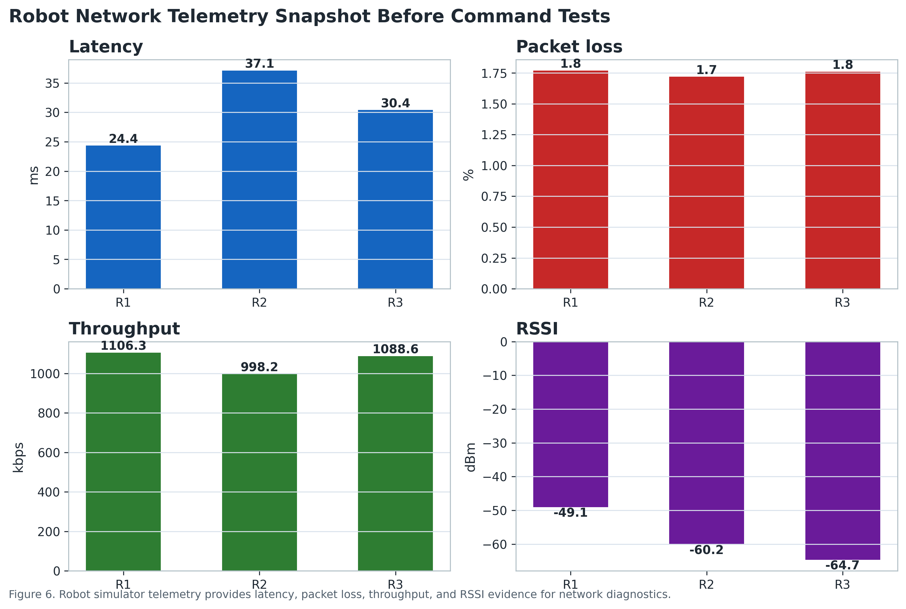
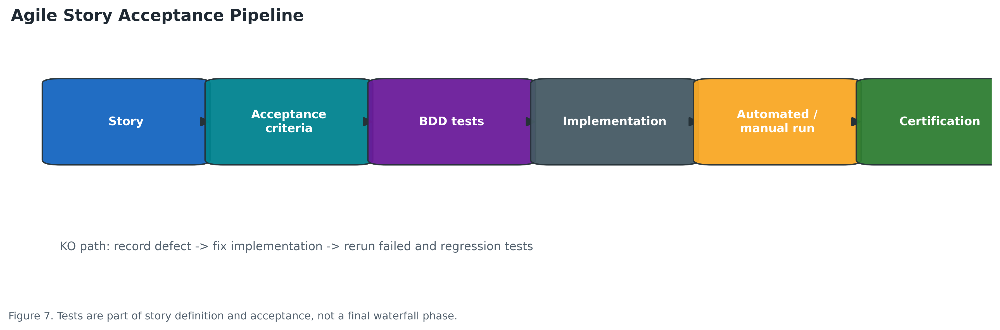

# Agile Test Process, Certifications, and Test Plan

Project: AutoFleet multi-robot supervision and V2X control stack  
Program context: Master IISC Pro 2nd Year, Agile Project Management   
Execution date: 2026-04-16  
Test Executor: [Jianke LIN](  

## 1. Purpose

This document defines a standards-compliant Agile testing workflow for the AutoFleet project and records the tests that can be executed locally in the current software stack.

The goal is to make each implemented user story acceptable through explicit tests. Each story must have at least one acceptance condition, and each acceptance condition must be linked to one or more tests written in Behavior Driven Development form:

```text
Given <initial system state>
When <event or user action>
Then <expected system state>
```

The tests in this document focus on the parts that can be validated in the current repository:

- Docker-based software stack startup
- Robot simulation telemetry
- V2X / MQTT command and acknowledgment flow
- Backend REST API
- Video worker stream registration and MJPEG proxy
- Perception, map, and coordination summaries
- Mission and formation orchestration
- Frontend and simulator monitor availability

Hardware-only items such as real LiDAR, motor encoders, Raspberry Pi 5 to ESP32 electrical communication, Xenomai real-time scheduling, and physical watchdog reset are listed as planned on-hardware validations. They are not certified by this local execution.

## 2. Agile Acceptance Workflow



Rules applied:

- A user story must have at least one acceptance condition.
- Each acceptance condition must be covered by one or more tests.
- Acceptance tests describe the expected execution of the story from the user or system point of view.
- If a story needs too many acceptance tests, the story is probably too large and should be split.
- Tests are not a final phase. They guide development and are rerun after each build to avoid regressions.

## 3. Test Plan Dimensions

### Story Dimension

The test plan covers the main vertical slices available in the current stack:

- Robot telemetry from simulator to backend to frontend
- Command dispatch from frontend/API to backend to MQTT to simulator
- Video metadata from simulator to video worker to backend/frontend
- Perception and map summaries from video snapshots to backend/frontend
- Mission and formation APIs across backend state, MQTT commands, and robot acknowledgments

### Test Type Dimension

| Test type | Usage in this project |
| --- | --- |
| Unit test | Used for isolated hardware/software modules when available, for example motor encoder logic or sensor drivers. Not yet automated in this repository. |
| Functional test | Validates one subsystem behavior, for example simulator telemetry or video stream registration. |
| Integration test | Validates communication between components, for example backend, MQTT broker, robot simulator, video worker, and database. |
| Scenario test | Validates an operator-level workflow, for example mission start, return, and stop. |
| Performance test | Validates non-functional behavior, for example repeated V2X command traffic and latency. |
| Reliability / safety test | Validates fail-safe behavior such as watchdog reset. Planned for hardware validation. |

### Time Dimension

| Moment | Test action |
| --- | --- |
| Before sprint development | Define acceptance criteria and BDD tests for each selected story. |
| During development | Add or refine tests when implementation details become clearer. |
| Before merging | Run all tests related to modified services and all regression smoke tests. |
| At sprint review | Present acceptance results and evidence to certify completed stories. |
| After every new build | Rerun automated tests to detect regressions. |

### Strategy Dimension

| Responsibility | Role |
| --- | --- |
| Product owner / client | Validates acceptance criteria and story value. |
| Developer | Writes unit tests and supports automation. |
| Tester / integrator | Defines BDD acceptance tests and executes scenario tests. |
| Team | Reviews failures and decides whether the story is accepted or returned to development. |

If a test is KO:

1. Record the failed test ID, environment, input data, and observed result.
2. Create or update a defect task.
3. Return the story to development if the failure blocks acceptance.
4. Rerun the failed test and all related regression tests after the fix.

### Environment Dimension

Executed environment:

| Component | Local endpoint / service |
| --- | --- |
| Docker Compose file | `infra/compose.yml` |
| Frontend | `http://127.0.0.1:3000` |
| Simulator monitor | `http://127.0.0.1:3000/sim-monitor.html` |
| Backend API | `http://127.0.0.1:8200/api/v1` |
| Video worker | `http://127.0.0.1:8400` |
| MQTT broker | `127.0.0.1:3889` |
| PostgreSQL | `127.0.0.1:5432` |
| Robot simulator | Docker service `robot-sim`, robots `R1`, `R2`, `R3` |

Evidence files:

- `docs/test-evidence/api/acceptance-results-20260416-102943.json`
- `docs/test-evidence/api/v2x-load-results-20260416-103551.json`

Screenshot placeholders are intentionally left empty because screenshots will be added manually later.

## 4. Data-Driven Test Figures

The following figures were generated directly from the JSON evidence files with `tools/generate_test_figures.py`. They are designed for report or paper usage: high-resolution PNG, consistent typography, explicit acceptance thresholds, and captions tied to the test evidence.



Figure 1 shows that the ten tests executed in the local MVP scope reached their acceptance criteria.



Figure 2 separates certified software/simulation scope from partial or not-yet-executed hardware validation.



Figure 3 summarizes the main evidence counts: robots online, video streams online, perception summaries, map summaries, and successful V2X load requests.



Figure 4 shows command response time over ten iterations for each robot. The red dashed line is the 500 ms performance criterion.



Figure 5 compares latency distributions for `R1`, `R2`, and `R3`; all observations remain below the acceptance threshold.



Figure 6 uses robot telemetry to compare latency, packet loss, throughput, and RSSI before command tests.



Figure 7 provides a report-ready version of the Agile story acceptance pipeline.

## 5. Executed Acceptance Tests

| ID | Subsystem | Objective | Type | Given / When / Then | Acceptance criterion | Result | Evidence |
| --- | --- | --- | --- | --- | --- | --- | --- |
| T01 | Docker stack | Validate that the complete software stack starts locally | Integration | Given Docker Desktop is running and `infra/compose.yml` is available. When `docker compose up -d` starts the stack. Then backend, MQTT, database, workers, simulator, and frontend are reachable. | Backend health is `ok`, MQTT connected, database available. | PASS | `acceptance-results-20260416-102943.json` |
| T02 | Robot simulation | Validate simulated robot telemetry | Functional | Given `robot-sim` publishes robots `R1`, `R2`, `R3`. When `/api/v1/robots` is requested. Then three robots are listed with fresh telemetry. | `robots_online_count = 3`. | PASS | `acceptance-results-20260416-102943.json` |
| T03 | Video worker | Validate simulated video source ingestion | Functional / Integration | Given each robot publishes `file:///artifacts/demo/highway-forward.mp4`. When `/streams` is requested from the video worker. Then three MJPEG proxy streams are registered. | `video_streams_online_count = 3`. | PASS | `acceptance-results-20260416-102943.json` |
| T04 | Perception and map summaries | Validate software perception outputs from snapshots | Functional | Given the video worker provides snapshots. When the perception worker analyzes them. Then backend exposes perception and map summaries. | `perception_count = 3`, `map_summary_count = 3`. | PASS | `acceptance-results-20260416-102943.json` |
| T05 | V2X command ACK | Validate command dispatch and acknowledgment | Integration | Given robot `R1` is online. When a teleop command and a STOP command are sent through the backend. Then the simulator receives the commands and publishes ACK messages. | ACK status is `ACCEPTED` for teleop and STOP. | PASS | `acceptance-results-20260416-102943.json` |
| T06 | Formation orchestration | Validate leader/follower state management | Integration | Given robots `R1`, `R2`, `R3` are online. When follow formation starts with `R1` as leader and `R2`, `R3` as followers. Then backend formation state becomes enabled. | `formation_enabled_during_test = true`. | PASS | `acceptance-results-20260416-102943.json` |
| T07 | Mission scenario | Validate mission start, return, and stop workflow | Scenario | Given a mission `qa-20260416-102943` with three robots. When the mission is started, returned, and stopped. Then the mission state is stored and reaches a final stopped state. | `mission_final_status = STOPPED`. | PASS | `acceptance-results-20260416-102943.json` |
| T08 | Frontend pages | Validate operator UI availability | Functional | Given the frontend container is running. When `/` and `/sim-monitor.html` are requested. Then both pages return HTTP 200. | `frontend_ok = true`, `sim_monitor_ok = true`. | PASS | `acceptance-results-20260416-102943.json` |
| T09 | V2X light load | Validate basic V2X stability under repeated commands | Performance | Given three robots are online. When 30 teleop commands are sent across `R1`, `R2`, and `R3`. Then all requests complete and the protocol has no pending commands after reset. | 30/30 successful requests, 0 failures, average HTTP response 45.89 ms, pending commands 0, all robots online. | PASS | `v2x-load-results-20260416-103551.json` |
| T10 | Persistence and events | Validate runtime persistence availability | Integration | Given PostgreSQL is configured. When backend health and events are requested. Then database is reported available and runtime events are exposed. | `database_available = true`; events endpoint responds. | PASS | `acceptance-results-20260416-102943.json` |

## 6. Certification Summary

| User story / capability | Certification status | Basis |
| --- | --- | --- |
| As an operator, I can see the state of the simulated fleet. | Certified | T01, T02, T08 |
| As an operator, I can send teleoperation commands to a robot. | Certified | T05 |
| As an operator, I can start and stop a mission for multiple robots. | Certified | T07 |
| As an operator, I can enable and disable leader/follower formation. | Certified | T06 |
| As the system, I can register and proxy simulated robot video streams. | Certified | T03 |
| As the system, I can publish perception and map summaries from video snapshots. | Certified | T04 |
| As the system, I can support light V2X traffic across three robots. | Certified for local light-load simulation | T09 |
| As the system, I can control real motors through Raspberry Pi 5 and ESP32. | Not certified yet | Requires hardware bench test |
| As the system, I can localize and map with ROS2 SLAM and LiDAR. | Not certified yet | Requires ROS2 / LiDAR simulation or real sensor environment |
| As the system, I can guarantee real-time scheduling under Xenomai. | Not certified yet | Requires target real-time OS environment |
| As the system, I can recover through hardware/software watchdog. | Not certified yet | Requires fault injection on the embedded target |

## 7. Mapping to the Subsystem Test Matrix

| Subsystem | Local validation status | Comment |
| --- | --- | --- |
| Mobile robot simulation | PASS | Validated through `robot-sim` telemetry and command response. |
| LiDAR in simulation | NOT EXECUTED | Current repository does not expose a ROS2 `/scan` LiDAR simulator. |
| Actuators / motors | NOT EXECUTED | Requires physical motor bench or ESP32 motor controller simulator. |
| Motor encoder | NOT EXECUTED | Requires encoder input data or hardware bench. |
| Raspberry Pi 5 to ESP32 communication | NOT EXECUTED | Requires serial/network link to ESP32 or a dedicated mock. |
| Embedded control architecture | PARTIAL | Software-level command separation is validated through backend to simulator; hardware role separation is not certified. |
| System watchdog | NOT EXECUTED | Requires controlled software lockup or target watchdog configuration. |
| Ultrasonic sensor | NOT EXECUTED | Requires physical sensor or sensor simulator. |
| Embedded camera | PARTIAL | File-based simulated camera stream is validated; real camera capture is not certified. |
| SLAM localization and mapping | NOT EXECUTED | Current stack exposes map summaries from perception heuristics, not ROS2 SLAM. |
| Autonomous navigation | PARTIAL | Mission orchestration is validated; path planning and collision-free physical navigation are not certified. |
| Multi-sensor integration | PARTIAL | Video, perception, telemetry, and coordination run together; physical LiDAR/camera/ultrasound fusion is not certified. |
| V2X communication | PASS | Backend, MQTT, robot simulator, ACKs, and telemetry are validated. |
| V2X performance | PASS for light load | 30 commands, 0 failures, average HTTP response 45.89 ms. |
| Complete system integration | PASS for local MVP stack | Full Docker software stack validated; hardware integration remains future work. |

## 8. Screenshot Placeholders

Screenshots should be added manually at these points:

1. Docker container status showing all services running.
2. Backend health endpoint: `http://127.0.0.1:8200/api/v1/health`.
3. Robot list endpoint: `http://127.0.0.1:8200/api/v1/robots`.
4. Video stream registry: `http://127.0.0.1:8400/streams`.
5. Main dashboard: `http://127.0.0.1:3000`.
6. Simulator monitor: `http://127.0.0.1:3000/sim-monitor.html`.
7. Mission final state for the executed QA mission.
8. V2X load result JSON or terminal output.

Recommended image naming:

```text
docs/test-evidence/screenshots/01-docker-compose-ps.png
docs/test-evidence/screenshots/02-backend-health.png
docs/test-evidence/screenshots/03-robots-api.png
docs/test-evidence/screenshots/04-video-streams.png
docs/test-evidence/screenshots/05-dashboard.png
docs/test-evidence/screenshots/06-sim-monitor.png
docs/test-evidence/screenshots/07-mission-final-state.png
docs/test-evidence/screenshots/08-v2x-load-result.png
```

## 9. Reproduction Commands

Start the full local stack:

```powershell
cd infra
$env:AUTOFLEET_API_PORT='8200'
$env:AUTOFLEET_PUBLIC_HOST='127.0.0.1'
docker compose up -d
```

Check service health:

```powershell
Invoke-RestMethod http://127.0.0.1:8200/api/v1/health
Invoke-RestMethod http://127.0.0.1:8200/api/v1/robots
Invoke-RestMethod http://127.0.0.1:8400/streams
```

Send a teleop command:

```powershell
Invoke-RestMethod `
  -Method POST `
  -ContentType 'application/json' `
  -Uri http://127.0.0.1:8200/api/v1/teleop/R1 `
  -Body '{"linear_x":0.35,"angular_z":0.12,"ttl_ms":700}'
```

Reset a robot to safe state:

```powershell
Invoke-RestMethod `
  -Method POST `
  -ContentType 'application/json' `
  -Uri http://127.0.0.1:8200/api/v1/robots/R1/command `
  -Body '{"type":"STOP","args":{"reason":"manual-reset"},"ttl_ms":2000}'
```

Generate the figures from saved evidence:

```powershell
python tools\generate_test_figures.py
```

## 10. Acceptance Decision

The local MVP software stack is accepted for the tested scope.

Certified scope:

- Local Docker startup
- Simulated three-robot telemetry
- Backend REST API health
- MQTT/V2X command and ACK loop
- Video worker stream ingestion from local demo video
- Perception and map summaries
- Mission and formation API workflows
- Frontend page availability
- Light V2X command-load stability

Not certified in this execution:

- Physical motors and actuators
- Motor encoders
- Raspberry Pi 5 to ESP32 hardware communication
- Real LiDAR and ultrasonic sensors
- ROS2 SLAM / RViz2 visualization
- Xenomai real-time scheduling
- Hardware watchdog reset
- Physical autonomous navigation without collision
